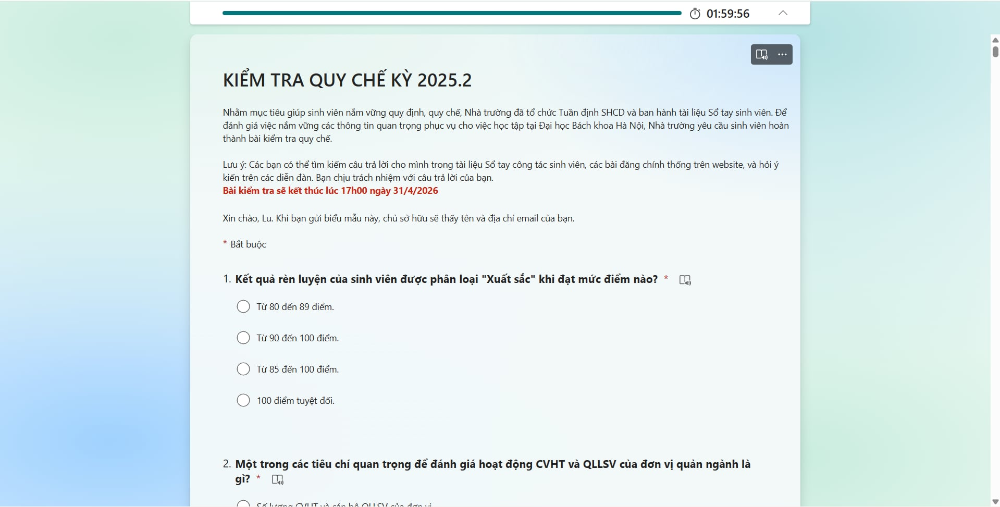
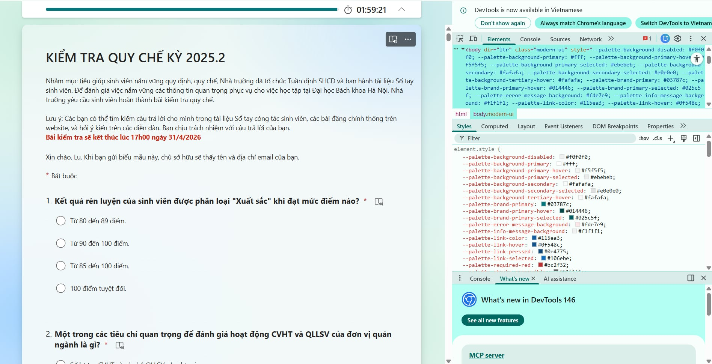
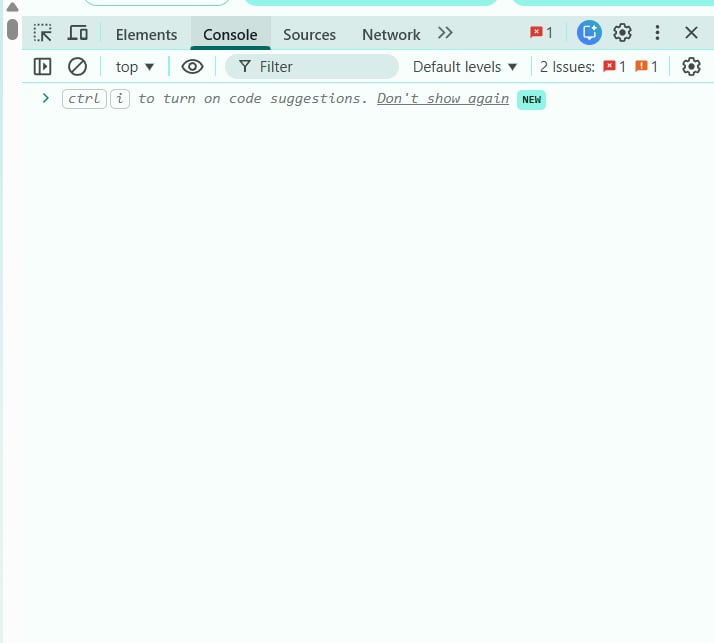
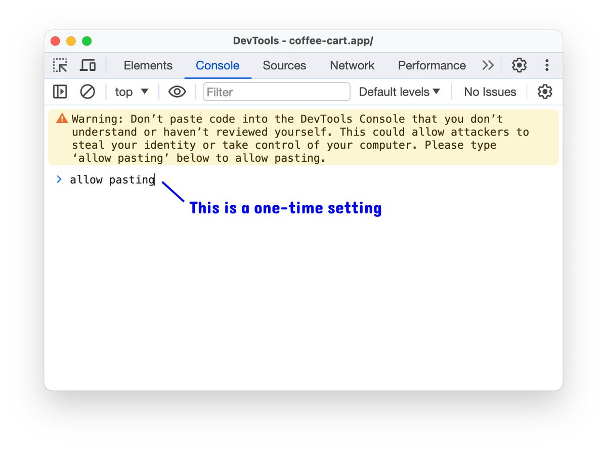
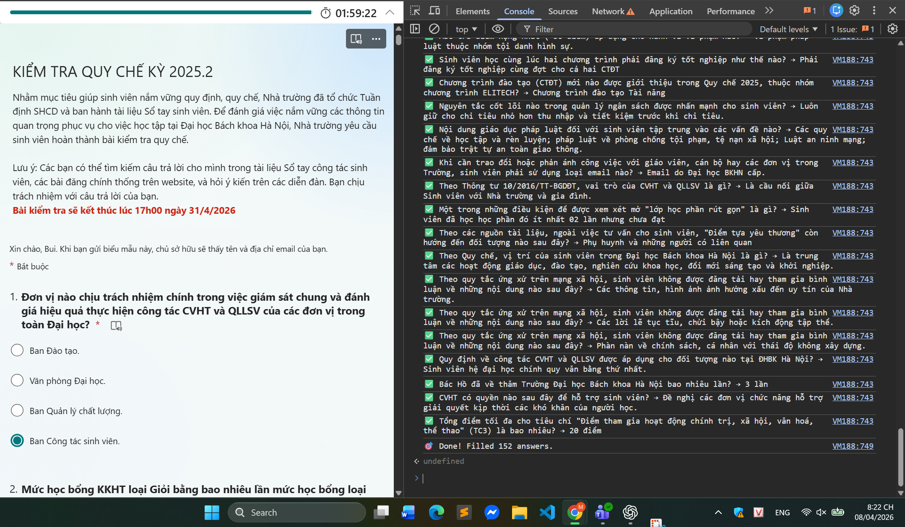
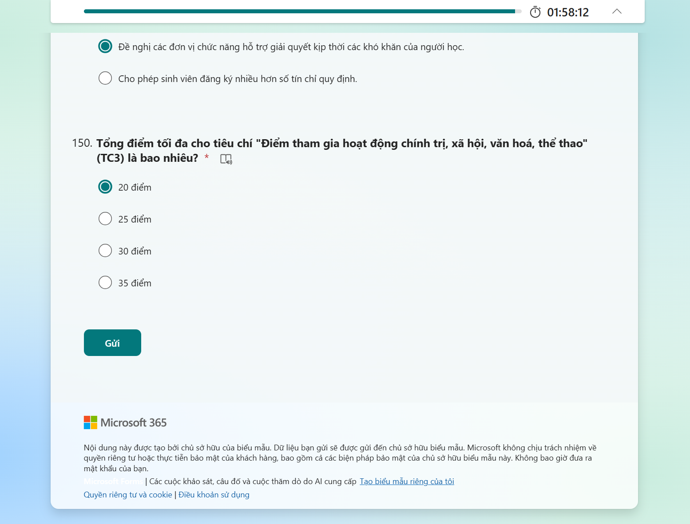

<h1 align="center">🚀 AUTO FILL BÀI KIỂM TRA QUY CHẾ VÀ PHÁP LUẬT</h1>

  Script giúp tự động điền bài kiểm tra Quy chế/Pháp luật bằng DevTools

  <b>⚡ Nhanh - Gọn - Không cần cài đặt</b>

<h2>📌 Giới thiệu</h2>

Repo này chứa file <code>code.txt</code> dùng để <b>auto fill bài kiểm tra Quy chế</b>. 
Bạn chỉ cần copy và chạy trong DevTools Console là xong.

<h2>🧩 Hướng dẫn chi tiết</h2>

<h3>🔹 Bước 1: Mở trang làm bài</h3>

Truy cập vào trang web làm bài kiểm tra Quy chế.

<!-- ẢNH BƯỚC 1 -->

  

---

<h3>🔹 Bước 2: Mở DevTools</h3>

<ul>
  <li>Nhấn <code>F12</code></li>
  <li>Hoặc <code>Ctrl + Shift + I</code></li>
  <li>Hoặc chuột phải → <b>Inspect</b></li>
</ul>

<!-- ẢNH BƯỚC 2 -->

  

---

<h3>🔹 Bước 3: Chọn tab Console</h3>

Click vào tab <b>Console</b> trong DevTools

<!-- ẢNH BƯỚC 3 -->

  

---

<h3>🔹 Bước 4: Copy code</h3>

Mở file <code>code.txt</code> trong repo →  
Nhấn <code>Ctrl + A</code> → <code>Ctrl + C</code>

---

<h3>🔹 Bước 5: Dán vào Console</h3>

Click vào Console → nhấn <code>Ctrl + V</code>

⚠️ Nếu thấy cảnh báo:

<pre>Warning: Don't paste code you don't understand</pre>

👉 Gõ:

<pre>allow pasting</pre>

Sau đó nhấn Enter rồi dán lại.

<!-- ẢNH BƯỚC 5 -->

  

---

<h3>🔹 Bước 6: Chạy code</h3>

Nhấn <b>Enter</b> → Script sẽ tự động chạy và fill bài

<!-- ẢNH BƯỚC 6 -->

  

<h2>✅ Kết quả</h2>

<ul>
  <li>Tự động điền đáp án</li>
  <li>Tiết kiệm thời gian 😎</li>
</ul>

<!-- ẢNH KẾT QUẢ -->

  

<h2>⚠️ Lưu ý</h2>

<ul>
  <li>Chỉ sử dụng khi bạn tin tưởng code</li>
  <li>Refresh trang sẽ mất hiệu lực</li>
  <li>Một số website có thể chặn script</li>
</ul>

<h2>📁 Cấu trúc repo</h2>

<pre>
.
└── code.txt   # Script auto fill
</pre>

<h2>💡 Tip</h2>

<ul>
  <li>Không chạy được → thử reload trang</li>
  <li>Kiểm tra lỗi trong Console</li>
  <li>Đảm bảo đang ở đúng trang làm bài</li>
</ul>

  🚀 Chúc bạn thành công!

